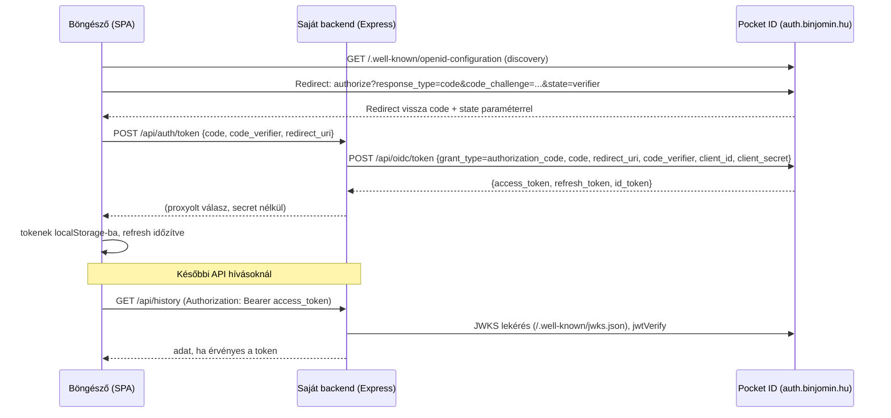

# Pocket ID OIDC Auth Setup Guide (reprodukálható minta)

> Ez a dokumentum a gemara-navigator projektben **éles, működő** Pocket ID
> (https://auth.binjomin.hu) alapú OIDC login rendszert írja le, olyan
> részletességgel, hogy más, hasonló felépítésű projektbe (statikus/vanilla JS
> SPA frontend + kis Node/Express API backend) egy AI ágens ez alapján
> elsőre, hiba nélkül tudja implementálni ugyanezt.
>
> A kódrészletek **szó szerint** a jelenlegi éles fájlokból vannak kimásolva.
> Ne írd újra őket "jobban" — másold be, majd csak a lent jelölt
> projekt-specifikus értékeket cseréld.

## 0. Ha csak egy dolgot olvasol el: a gotchák

Ez a szekció a legfontosabb — ezek miatt kellett több iteráció, mire az
eredeti implementáció stabilan, permanensen működött.

| # | Tünet | Ok | Javítás |
|---|-------|-----|---------|
| 1 | Token exchange 400-at ad Pocket ID-től | `redirect_uri` nem egyezik pontosan a frontend és a backend `OIDC_REDIRECT_URI` env között (pl. trailing slash, www vs. non-www, http vs. https) | Frontend mindig `window.location.origin + '/'`-t küld → a backend `OIDC_REDIRECT_URI` env-je legyen **pontosan** ez a string, és ez legyen bejegyezve Pocket ID-ban is |
| 2 | Refresh token sosem érkezik meg | Hiányzik az `offline_access` scope a login authorize kérésből | A frontend `scope` paramétere mindig tartalmazza: `openid profile email offline_access` |
| 3 | 401-es hiba a `/api/auth/token` vagy `/api/oidc/token` hívásnál, pedig a code jó | A böngésző a `client_secret`-et sosem ismerheti (PKCE public client), de Pocket ID kliens mégis konfigurálva van secret-tel → a secretet csak a **backend** adja hozzá a tényleges Pocket ID hívásnál | A frontend csak `code` + `code_verifier` + `redirect_uri`-t küld a saját backendjének; a backend egészíti ki `client_id`+`client_secret`-tel, mielőtt továbbküldi Pocket ID-nak |
| 4 | CORS hiba minden API hívásnál | Nincs beállítva vagy hibás a `CORS_ORIGIN` env | `CORS_ORIGIN` legyen pontosan a frontend origin (protokoll+domain, path nélkül); ha üres, a szerver explicit **elutasít mindent** (`origin: false`) — ez szándékos fail-closed viselkedés, ne "javítsd ki" `origin: '*'`-ra |
| 5 | Szerver nem érhető el kívülről, vagy pont fordítva: aggódsz a biztonság miatt | A backend szándékosan `127.0.0.1`-re bindel | Reverse proxy (nginx/caddy) kötelező elé; ne bindelj `0.0.0.0`-ra hacsak nincs saját firewall/proxy réteg |
| 6 | Végtelen redirect loop vagy user kijelentkeztetve marad | 401 kezelésnél nincs retry-limit, vagy a refresh maga is 401-et dob | Az `api()` helperben **pontosan egyszeri** refresh-then-retry legyen, utána logout — sose retry-olj korlátlanul |
| 7 | Token exchange endpoint 404 Pocket ID felől | Pocket ID token endpointja **nem** a szabvány `/token`, hanem `/api/oidc/token` | `exchangeWithPocketId()`-ben mindig `${issuer}/api/oidc/token`-t hívj; a JWKS (`/.well-known/jwks.json`) és a discovery (`/.well-known/openid-configuration`) viszont szabványos path-ok |
| 8 | Refresh token biztonsági aggály code review-ban | A refresh token `localStorage`-ban van tárolva, nem httpOnly cookie-ban | Ez tudatos, dokumentált trade-off egyszerű statikus SPA-hoz (nincs saját backend session, nincs sok user-generated/XSS felület); ha a célprojektnek van XSS-re hajlamos felülete (pl. rich text render), fontold meg httpOnly cookie + BFF mintát helyette |
| 9 | Bejelentkezés utáni visszatérési URL elveszik | A `state` paraméter a PKCE verifier, nem tartalmazhatja az eredeti path-et | Az eredeti path-et külön `sessionStorage` kulcsban (`navigator.returnPath`) told el, ne a `state`-be zsúfold |
| 10 | Token lejár, de a user nem kap új tokent háttérben lévő tabnál | `setTimeout` háttérben throttle-ölhető/felfüggesztődhet | `visibilitychange` eseményre is ellenőrizd a lejáratot, ne csak a timer-re hagyatkozz |
| 11 | Discovery hívás minden login-nál lassítja a redirectet | Nincs cache-elve a `/.well-known/openid-configuration` válasz | Ez tudatos egyszerűsítés; ha zavaró, cache-elhető, de nem kötelező javítani |

---

## 1. Áttekintés

**Flow**: Authorization Code + PKCE (S256), publikus SPA kliens fut a
böngészőben, de a **token-csere és a refresh egy saját backend proxy
endponton megy át**, ami hozzáadja a `client_secret`-et. Így a Pocket ID
kliens "confidential" konfigurációval üzemel, de a secret sosem kerül a
böngészőbe.



Alkalmazható: statikus/vanilla JS (vagy bármilyen) SPA frontend + Express (vagy
hasonló) backend, ahol a session-t JWT access tokenekkel oldod meg, saját DB-ben
csak a `sub` claim (user id) alapján tárolsz adatot.

---

## 2. Előfeltételek

1. Pocket ID szerver fut és elérhető (pl. `https://auth.binjomin.hu`).
2. Pocket ID adminban regisztrált OIDC kliens:
   - **Client ID** (ugyanaz a frontend és a backend számára).
   - **Client Secret** (csak a backend ismeri, sosem kerül a frontendbe).
   - **Redirect URI** pontosan bejegyezve, karakterre egyezően azzal, amit a
     frontend használni fog (jellemzően `https://<domain>/`).
3. A frontend és a backend külön domainen/subdomainen futhatnak — ekkor a
   backend `CORS_ORIGIN` env-jét a frontend originre kell állítani.

---

## 3. Környezeti változók

| Változó | Hol | Példa érték | Jelentés |
|---|---|---|---|
| `oidcIssuer` | frontend, `config.js` (hardcode) | `https://auth.binjomin.hu` | Pocket ID base URL |
| `oidcClientId` | frontend, `config.js` (hardcode) | `fa9a2ade-...` | Ugyanaz a client ID, mint a backend `OIDC_CLIENT_ID` |
| `apiBaseUrl` | frontend, `config.js` (hardcode) | `https://api.example.com` | Saját backend API base URL |
| `PORT` | backend `.env` | `4001` | Express szerver portja (csak localhost-on hallgat) |
| `DATABASE_PATH` | backend `.env` | `./data/history.db` | SQLite fájl útvonala (projekt-specifikus, nem auth-related) |
| `OIDC_ISSUER` | backend `.env` | `https://auth.binjomin.hu` | Ugyanaz, mint a frontend `oidcIssuer` |
| `OIDC_CLIENT_ID` | backend `.env` | `fa9a2ade-...` | Ugyanaz, mint a frontend `oidcClientId` |
| `OIDC_CLIENT_SECRET` | backend `.env` | (titkos) | **Sosem** kerül a frontendbe, csak a backend token-exchange hívásban |
| `OIDC_REDIRECT_URI` | backend `.env` | `https://example.com/` | Pontosan egyeznie kell a frontend `redirectUri()` kimenetével és a Pocket ID-ban regisztrált redirect URI-val |
| `CORS_ORIGIN` | backend `.env` | `https://example.com` | Vesszővel elválasztott lista; ha üres, minden kérés el lesz utasítva |
| `OIDC_AUDIENCE` | backend `.env` (opcionális) | — | Ha a Pocket ID kliens `aud` claimet állít be, itt validálható |

Referencia: [server/.env.example](server/.env.example)
```
PORT=4001
DATABASE_PATH=./data/history.db
OIDC_ISSUER=https://auth.binjomin.hu
OIDC_CLIENT_ID=
OIDC_CLIENT_SECRET=
OIDC_REDIRECT_URI=https://gemara.myshiurim.com/
CORS_ORIGIN=https://gemara.myshiurim.com
```

---

## 4. Frontend implementáció

### 4.1 Config (`js/config.js`)

Csak ezek az értékek projekt-specifikusak, minden mást változatlanul másolj:

```js
window.NAVIGATOR_CONFIG = {
  oidcIssuer: 'https://auth.binjomin.hu',
  // Pocket ID public client ID. A browseres PKCE klienshez nincs secret.
  oidcClientId: 'fa9a2ade-4a16-41e0-b991-ae370d550305',
  apiBaseUrl: 'https://api.gemara.myshiurim.com'
};
```
→ Testreszabás: `oidcIssuer`, `oidcClientId`, `apiBaseUrl`. A globális objektum
nevét (`NAVIGATOR_CONFIG`) érdemes az új projekt nevére cserélni, de ha
maradsz az eredetinél, semmi nem törik el.

### 4.2 Auth modul (`js/auth.js`)

Ez a fájl **teljes egészében, változtatás nélkül** átvihető más projektbe —
egyetlen külső függése a `window.NAVIGATOR_CONFIG` objektum (4.1 pont) és a
natív böngésző API-k (`fetch`, `crypto.subtle`, `localStorage`,
`sessionStorage`). Nincs npm függősége.

```js
(() => {
  const config = window.NAVIGATOR_CONFIG;
  const tokenKey = 'navigator.accessToken';
  const refreshTokenKey = 'navigator.refreshToken';
  const userNameKey = 'navigator.userName';
  const verifierKey = 'navigator.pkceVerifier';
  const returnPathKey = 'navigator.returnPath';
  const debugLogKey = 'navigator.authDebugLog';
  let accessToken = localStorage.getItem(tokenKey) || sessionStorage.getItem(tokenKey);
  let refreshToken = localStorage.getItem(refreshTokenKey);
  let userName = localStorage.getItem(userNameKey) || sessionStorage.getItem(userNameKey) || '';
  let historyKeys = new Set();
  let refreshTimer = null;

  // Ring-buffer debug log (kept in localStorage) so auth issues can be
  // diagnosed after the fact via window.NavigatorAuth.getDebugLog().
  function logDebug(event, details) {
    const entry = { time: new Date().toISOString(), event, ...(details || {}) };
    console.debug(`[NavigatorAuth] ${entry.time} ${event}`, details || '');
    try {
      const log = JSON.parse(localStorage.getItem(debugLogKey) || '[]');
      log.push(entry);
      localStorage.setItem(debugLogKey, JSON.stringify(log.slice(-50)));
    } catch { /* Storage may be unavailable; logging is best-effort. */ }
  }

  function decodeJwtPayload(token) {
    try {
      const payload = token.split('.')[1];
      const normalized = payload.replace(/-/g, '+').replace(/_/g, '/');
      return JSON.parse(atob(normalized.padEnd(Math.ceil(normalized.length / 4) * 4, '=')));
    } catch {
      return {};
    }
  }

  function getUserName(claims) {
    return claims.name || claims.preferred_username || claims.email || claims.nickname || 'felhasználó';
  }

  // Only used to show the username immediately; expiry is handled in initialize()
  // so an expired token can first try a silent refresh instead of forcing logout.
  if (accessToken && !userName) {
    userName = getUserName(decodeJwtPayload(accessToken));
  }

  function base64Url(bytes) {
    let binary = '';
    bytes.forEach(byte => { binary += String.fromCharCode(byte); });
    return btoa(binary).replace(/\+/g, '-').replace(/\//g, '_').replace(/=+$/, '');
  }

  async function createCodeChallenge(verifier) {
    const data = new TextEncoder().encode(verifier);
    const digest = await crypto.subtle.digest('SHA-256', data);
    return base64Url(new Uint8Array(digest));
  }

  function createVerifier() {
    const bytes = new Uint8Array(32);
    crypto.getRandomValues(bytes);
    return base64Url(bytes);
  }

  async function discover() {
    const response = await fetch(`${config.oidcIssuer.replace(/\/$/, '')}/.well-known/openid-configuration`);
    if (!response.ok) throw new Error('OIDC discovery failed');
    return response.json();
  }

  function redirectUri() {
    return `${window.location.origin}/`;
  }

  async function login() {
    if (!config.oidcClientId) throw new Error('OIDC client ID is not configured');
    const metadata = await discover();
    const verifier = createVerifier();
    const challenge = await createCodeChallenge(verifier);
    sessionStorage.setItem(verifierKey, verifier);
    const currentParams = new URLSearchParams(window.location.search);
    const returnPath = currentParams.has('code') || currentParams.has('error')
      ? window.location.pathname
      : `${window.location.pathname}${window.location.search}`;
    sessionStorage.setItem(returnPathKey, returnPath);
    const params = new URLSearchParams({
      response_type: 'code',
      client_id: config.oidcClientId,
      redirect_uri: redirectUri(),
      scope: 'openid profile email offline_access',
      state: verifier,
      code_challenge: challenge,
      code_challenge_method: 'S256'
    });
    logDebug('login.redirect');
    window.location.assign(`${metadata.authorization_endpoint}?${params}`);
  }

  async function handleCallback() {
    const params = new URLSearchParams(window.location.search);
    const callbackError = params.get('error');
    if (callbackError) {
      throw new Error(`OIDC authorization failed: ${callbackError}${params.get('error_description') ? ` (${params.get('error_description')})` : ''}`);
    }
    const code = params.get('code');
    if (!code) return;
    const verifier = sessionStorage.getItem(verifierKey);
    if (!verifier || params.get('state') !== verifier) throw new Error('Invalid OIDC state');
    const response = await fetch(`${config.apiBaseUrl}/api/auth/token`, {
      method: 'POST',
      headers: { 'Content-Type': 'application/x-www-form-urlencoded' },
      body: new URLSearchParams({
        code,
        code_verifier: verifier,
        redirect_uri: redirectUri(),
      })
    });
    const responseText = await response.text();
    if (!response.ok) {
      let details = responseText;
      try { details = JSON.stringify(JSON.parse(responseText)); } catch { /* Keep plain response text. */ }
      throw new Error(`OIDC token exchange failed (${response.status}): ${details || 'empty response'}`);
    }
    const tokens = JSON.parse(responseText);
    if (!tokens.access_token) throw new Error('OIDC token exchange returned no access token');
    applyTokens(tokens, 'login');
    sessionStorage.removeItem(tokenKey);
    sessionStorage.removeItem(userNameKey);
    sessionStorage.removeItem(verifierKey);
    const returnPath = sessionStorage.getItem(returnPathKey) || window.location.pathname;
    sessionStorage.removeItem(returnPathKey);
    window.history.replaceState(null, '', returnPath);
  }

  function applyTokens(tokens, source) {
    accessToken = tokens.access_token;
    if (tokens.refresh_token) refreshToken = tokens.refresh_token;
    const claims = decodeJwtPayload(tokens.id_token || accessToken);
    userName = getUserName(claims);
    localStorage.setItem(tokenKey, accessToken);
    localStorage.setItem(userNameKey, userName);
    if (refreshToken) localStorage.setItem(refreshTokenKey, refreshToken);
    logDebug(`${source}.tokens_applied`, { exp: claims.exp, hasRefreshToken: Boolean(refreshToken) });
    scheduleRefresh(claims.exp);
  }

  function scheduleRefresh(exp) {
    if (refreshTimer) clearTimeout(refreshTimer);
    if (!exp || !refreshToken) return;
    // Refresh 60s before expiry so the API never sees an expired token.
    const delay = Math.max(exp * 1000 - Date.now() - 60000, 5000);
    refreshTimer = setTimeout(() => { refreshAccessToken().catch(error => logDebug('refresh.scheduled_failed', { message: error.message })); }, delay);
    logDebug('refresh.scheduled', { delayMs: delay });
  }

  async function refreshAccessToken() {
    if (!refreshToken) throw new Error('No refresh token available');
    logDebug('refresh.attempt');
    const response = await fetch(`${config.apiBaseUrl}/api/auth/refresh`, {
      method: 'POST',
      headers: { 'Content-Type': 'application/x-www-form-urlencoded' },
      body: new URLSearchParams({ refresh_token: refreshToken })
    });
    const responseText = await response.text();
    if (!response.ok) {
      logDebug('refresh.failed', { status: response.status, body: responseText.slice(0, 300) });
      throw new Error(`Refresh failed (${response.status}): ${responseText}`);
    }
    const tokens = JSON.parse(responseText);
    applyTokens(tokens, 'refresh');
    document.dispatchEvent(new CustomEvent('navigator-auth-updated'));
    return accessToken;
  }

  // Background tabs can have their setTimeout throttled or suspended, so also
  // check on return-to-foreground instead of relying on the timer alone.
  document.addEventListener('visibilitychange', () => {
    if (document.visibilityState !== 'visible' || !accessToken) return;
    const claims = decodeJwtPayload(accessToken);
    if (claims.exp && claims.exp * 1000 - Date.now() < 60000) {
      refreshAccessToken().catch(error => {
        logDebug('visibilitychange.refresh_failed', { message: error.message });
        logout(false);
      });
    }
  });

  async function api(path, options = {}, retried = false) {
    if (!accessToken) return null;
    const response = await fetch(`${config.apiBaseUrl}${path}`, {
      ...options,
      headers: {
        ...(options.headers || {}),
        Authorization: `Bearer ${accessToken}`,
        'Content-Type': 'application/json'
      }
    });
    if (response.status === 401) {
      logDebug('api.unauthorized', { path, retried });
      if (!retried && refreshToken) {
        try {
          await refreshAccessToken();
          return api(path, options, true);
        } catch (error) {
          logDebug('api.refresh_after_401_failed', { message: error.message });
        }
      }
      logout(false);
      return null;
    }
    if (!response.ok) throw new Error(`API request failed: ${response.status}`);
    return response.status === 204 ? null : response.json();
  }

  async function loadHistory() {
    const result = await api('/api/history');
    historyKeys = new Set((result?.history || []).map(entry => `${entry.navigator}:${entry.work}:${entry.item}`));
    return historyKeys;
  }

  function hasVisited(navigator, work, item) {
    return historyKeys.has(`${navigator}:${work}:${item}`);
  }

  async function recordVisit(navigator, work, item) {
    if (!accessToken) return;
    historyKeys.add(`${navigator}:${work}:${item}`);
    document.dispatchEvent(new CustomEvent('navigator-history-updated'));
    try {
      await api('/api/history', {
        method: 'POST',
        body: JSON.stringify({ navigator, work, item })
      });
    } catch (error) {
      console.error(error);
    }
  }

  function logout(redirect = true) {
    logDebug('logout', { redirect });
    accessToken = null;
    refreshToken = null;
    userName = '';
    historyKeys = new Set();
    if (refreshTimer) clearTimeout(refreshTimer);
    localStorage.removeItem(tokenKey);
    localStorage.removeItem(refreshTokenKey);
    localStorage.removeItem(userNameKey);
    sessionStorage.removeItem(tokenKey);
    sessionStorage.removeItem(userNameKey);
    document.dispatchEvent(new CustomEvent('navigator-auth-updated'));
    if (redirect) window.location.reload();
  }

  async function initialize() {
    try {
      await handleCallback();
      if (accessToken) {
        const claims = decodeJwtPayload(accessToken);
        const expiringSoon = !claims.exp || claims.exp * 1000 - Date.now() < 60000;
        if (expiringSoon && refreshToken) {
          logDebug('startup.silent_refresh', { exp: claims.exp });
          await refreshAccessToken().catch(error => {
            logDebug('startup.silent_refresh_failed', { message: error.message });
            logout(false);
          });
        } else if (expiringSoon) {
          logDebug('startup.access_token_expired_no_refresh_token', { exp: claims.exp });
          logout(false);
        } else {
          scheduleRefresh(claims.exp);
        }
      }
      await loadHistory();
    } catch (error) {
      logDebug('initialize.failed', { message: error.message });
      document.dispatchEvent(new CustomEvent('navigator-auth-error', { detail: error.message }));
    }
    document.dispatchEvent(new CustomEvent('navigator-auth-ready'));
  }

  window.NavigatorAuth = {
    login: () => login().catch(error => {
      logDebug('login.failed', { message: error.message });
      document.dispatchEvent(new CustomEvent('navigator-auth-error', { detail: error.message }));
    }),
    logout,
    hasVisited,
    loadHistory,
    recordVisit,
    getDebugLog: () => { try { return JSON.parse(localStorage.getItem(debugLogKey) || '[]'); } catch { return []; } },
    getUserName: () => userName,
    isAuthenticated: () => Boolean(accessToken)
  };

  initialize();
})();
```

**Ha a célprojektnek nincs "history" funkciója**: a `loadHistory` /
`hasVisited` / `recordVisit` / a `/api/history` hívások és a
`navigator-history-updated` event projekt-specifikusak (ez a gemara-navigator
saját funkciója, nem az auth része) — nyugodtan törölhetők, minden más
(PKCE, token tárolás, refresh, `api()` helper, debug log, eventek) az
**auth mag**, amit meg kell tartani.

### 4.3 HTML integráció

Script betöltési sorrend — **config.js mindig auth.js előtt**:
```html
<script src="/js/config.js"></script>
<script src="/js/auth.js"></script>
```

Minimális UI markup (gomb + státusz felirat):
```html
<div id="auth-controls"><span id="auth-status"></span><button id="login-button" type="button">Belépés</button></div>
```

Bekötés + eseménykezelés:
```js
function updateAuthControls() {
  const button = document.getElementById('login-button');
  const status = document.getElementById('auth-status');
  if (!button) return;
  const authenticated = window.NavigatorAuth?.isAuthenticated() === true;
  if (status) status.textContent = authenticated ? `Üdv ${window.NavigatorAuth.getUserName()}!` : '';
  button.textContent = authenticated ? 'Kilépés' : 'Belépés';
  button.onclick = () => authenticated ? window.NavigatorAuth.logout() : window.NavigatorAuth.login();
}

document.addEventListener('DOMContentLoaded', () => {
  updateAuthControls();
  document.addEventListener('navigator-auth-ready', () => {
    updateAuthControls();
    // itt hívd a saját, auth-hoz kötött init logikádat (pl. látogatási előzmények betöltése)
  });
  document.addEventListener('navigator-auth-updated', updateAuthControls);
  document.addEventListener('navigator-auth-error', event => {
    const status = document.getElementById('auth-status');
    if (status) status.textContent = `API hiba: ${event.detail}`;
  });
});
```

Fontos: `NavigatorAuth` **aszinkron inicializálódik** (`initialize()` a modul
végén hívódik). Ne feltételezd, hogy `isAuthenticated()` azonnal helyes
választ ad az oldal betöltésekor — várd meg a `navigator-auth-ready` eventet.

---

## 5. Backend implementáció

### 5.1 JWT validáló middleware (`server/src/auth.js`)

Teljes egészében átvihető, változtatás nélkül. Csak `jose` npm csomagot
igényel.

```js
import { createRemoteJWKSet, jwtVerify } from 'jose';

const issuer = process.env.OIDC_ISSUER?.replace(/\/$/, '');
const audience = process.env.OIDC_AUDIENCE || undefined;
const jwks = issuer ? createRemoteJWKSet(new URL(`${issuer}/.well-known/jwks.json`)) : null;

export async function requireAuth(req, res, next) {
  if (!issuer || !jwks) {
    return res.status(503).json({ error: 'Authentication is not configured' });
  }

  const authorization = req.get('authorization') || '';
  const match = authorization.match(/^Bearer\s+(.+)$/i);
  if (!match) {
    return res.status(401).json({ error: 'Bearer token required' });
  }

  try {
    const verification = await jwtVerify(match[1], jwks, {
      issuer,
      ...(audience ? { audience } : {})
    });
    const userId = verification.payload.sub;
    if (typeof userId !== 'string' || userId.length === 0) {
      return res.status(401).json({ error: 'Token has no subject' });
    }
    req.user = { id: userId, claims: verification.payload };
    return next();
  } catch {
    return res.status(401).json({ error: 'Invalid access token' });
  }
}
```

Használat bármelyik védett route-on: `router.get('/valami', requireAuth, (req, res) => { req.user.id ... })`.

### 5.2 Token/refresh proxy endpointok (`server/src/routes.js` releváns része)

```js
import { Router } from 'express';

const router = Router();

// Structured auth logging: PM2 captures stdout/stderr into
// ~/.pm2/logs/<app-name>-out.log / -error.log, so this
// doubles as the persistent debug log without adding a new file.
function logAuthEvent(event, details) {
  console.log(`[auth] ${new Date().toISOString()} ${event}`, JSON.stringify(details));
}

async function exchangeWithPocketId(grantParams) {
  const issuer = process.env.OIDC_ISSUER?.replace(/\/$/, '');
  const clientId = process.env.OIDC_CLIENT_ID;
  const clientSecret = process.env.OIDC_CLIENT_SECRET;
  if (!issuer || !clientId || !clientSecret) return { status: 503, body: JSON.stringify({ error: 'OIDC server configuration is incomplete' }) };

  const response = await fetch(`${issuer}/api/oidc/token`, {
    method: 'POST',
    headers: { 'Content-Type': 'application/x-www-form-urlencoded' },
    body: new URLSearchParams({ client_id: clientId, client_secret: clientSecret, ...grantParams })
  });
  return { status: response.status, body: await response.text() };
}

router.post('/auth/token', async (req, res, next) => {
  const { code, code_verifier: codeVerifier, redirect_uri: redirectUri } = req.body || {};
  const configuredRedirectUri = process.env.OIDC_REDIRECT_URI;

  if (!configuredRedirectUri) {
    logAuthEvent('token.config_missing', {});
    return res.status(503).json({ error: 'OIDC server configuration is incomplete' });
  }
  if (
    typeof code !== 'string' ||
    typeof codeVerifier !== 'string' ||
    redirectUri !== configuredRedirectUri
  ) {
    logAuthEvent('token.invalid_request', { hasCode: typeof code === 'string', redirectUriMatches: redirectUri === configuredRedirectUri });
    return res.status(400).json({ error: 'Invalid OIDC token request' });
  }

  try {
    const { status, body } = await exchangeWithPocketId({
      grant_type: 'authorization_code',
      code,
      redirect_uri: configuredRedirectUri,
      code_verifier: codeVerifier
    });
    logAuthEvent(status === 200 ? 'token.success' : 'token.failed', { status });
    res.status(status).type('application/json').send(body);
  } catch (error) {
    logAuthEvent('token.error', { message: error.message });
    next(error);
  }
});

router.post('/auth/refresh', async (req, res, next) => {
  const { refresh_token: refreshToken } = req.body || {};
  if (typeof refreshToken !== 'string' || refreshToken.length === 0) {
    logAuthEvent('refresh.invalid_request', {});
    return res.status(400).json({ error: 'Invalid refresh request' });
  }

  try {
    const { status, body } = await exchangeWithPocketId({
      grant_type: 'refresh_token',
      refresh_token: refreshToken
    });
    logAuthEvent(status === 200 ? 'refresh.success' : 'refresh.failed', { status });
    res.status(status).type('application/json').send(body);
  } catch (error) {
    logAuthEvent('refresh.error', { message: error.message });
    next(error);
  }
});

export default router;
```

Ne felejtsd: a router-t az app-ban `/api` prefix alá kell kötni (lásd 6.
pont), így a végleges útvonalak `/api/auth/token` és `/api/auth/refresh`
lesznek — ezek pontosan a frontend `config.apiBaseUrl + '/api/auth/token'`
hívásainak felelnek meg.

---

## 6. Express app bekötés (`server/src/index.js`)

```js
import 'dotenv/config';
import express from 'express';
import cors from 'cors';
import routes from './routes.js';

const app = express();
const port = Number(process.env.PORT || 4000);
const allowedOrigins = (process.env.CORS_ORIGIN || '')
  .split(',')
  .map(origin => origin.trim())
  .filter(Boolean);

app.disable('x-powered-by');
app.use(cors({
  origin: allowedOrigins.length > 0 ? allowedOrigins : false,
  methods: ['GET', 'POST'],
  allowedHeaders: ['Authorization', 'Content-Type']
}));
app.use(express.json({ limit: '10kb' }));
app.use(express.urlencoded({ extended: false, limit: '10kb' }));
app.use('/api', routes);

app.use((error, req, res, next) => {
  if (error instanceof SyntaxError && error.status === 400 && 'body' in error) {
    return res.status(400).json({ error: 'Invalid JSON' });
  }
  return next(error);
});

app.listen(port, '127.0.0.1', () => {
  console.log(`API listening on 127.0.0.1:${port}`);
});
```

Lényeges pontok, amiket ne változtass meg gondolkodás nélkül:
- `express.urlencoded` **kötelező**, mert a frontend `application/x-www-form-urlencoded` body-t küld a `/api/auth/token` és `/api/auth/refresh` hívásokhoz.
- `cors({ origin: allowedOrigins.length > 0 ? allowedOrigins : false })` — fail-closed default.
- `app.listen(port, '127.0.0.1', ...)` — sosem publikus interfészen.

---

## 7. Függőségek

Backend (`server/package.json` releváns része):
```json
{
  "type": "module",
  "engines": { "node": ">=20" },
  "dependencies": {
    "cors": "^2.8.5",
    "dotenv": "^16.5.0",
    "express": "^5.1.0",
    "jose": "^6.0.11"
  }
}
```

Frontend: **nulla npm függőség** — natív `fetch`, `crypto.subtle`,
`localStorage`/`sessionStorage`, `CustomEvent` API-kat használ. Ha a
célprojekt build-elt (bundlelt) frontend, az `auth.js` akkor is
módosítás nélkül működik plain `<script>`-ként.

---

## 8. Deployment jegyzetek

PM2 minta (`server/ecosystem.config.cjs`):
```js
module.exports = {
  apps: [{
    name: 'my-app-api',
    script: 'src/index.js',
    cwd: __dirname,
    env: {
      NODE_ENV: 'production',
      PORT: 4001
    },
    instances: 1,
    exec_mode: 'fork',
    autorestart: true,
    watch: false,
    ignore_watch: ['node_modules', 'data', 'logs', '*.db', '*.db-shm', '*.db-wal'],
    max_memory_restart: '128M',
    time: true
  }]
};
```

- A szerver `127.0.0.1`-re bindel → **kötelező** egy reverse proxy
  (nginx/caddy) elé, ami TLS-t és a publikus domain routingot kezeli.
- Az auth-related logok (`[auth] ...` prefixszel) egyszerű `console.log`-gal
  mennek, amit PM2 fájlba gyűjt (`~/.pm2/logs/<name>-out.log`) — nincs külön
  logging infrastruktúra, ez tudatos egyszerűsítés.

---

## 9. Tesztelési/ellenőrzési lépések

Miután mindkét oldal be van kötve, ebben a sorrendben ellenőrizd:

1. **Login redirect**: kattints a login gombra → a böngésző a Pocket ID
   authorize URL-jére navigál, `client_id`, `redirect_uri`, `code_challenge`,
   `state` paraméterekkel.
2. **Callback + token csere**: sikeres Pocket ID login után a böngésző
   visszatér `?code=...&state=...`-vel, majd az URL megtisztul (history
   replaceState) és a login gomb "Kilépés"-re vált.
3. **API hívás Bearer tokennel**: nyisd meg a devtools Network fület, nézd
   meg hogy egy védett endpoint hívás (`/api/history` vagy hasonló)
   `Authorization: Bearer ...` headerrel megy, és 200-at kap.
4. **Debug log ellenőrzés**: konzolban `NavigatorAuth.getDebugLog()` —
   tartalmaznia kell `login.redirect`, `login.tokens_applied`,
   `refresh.scheduled` bejegyzéseket.
5. **Automatikus refresh megfigyelése**: ha van mód rá, állíts rövid
   token lejáratot a Pocket ID kliens configban, és figyeld meg hogy
   `refresh.attempt` / `refresh.success` esemény fut le lejárat előtt kb.
   60mp-cel, felhasználói interakció nélkül.
6. **401 → refresh → retry**: manuálisan írj felül egy access tokent
   érvénytelenre (`localStorage.setItem('navigator.accessToken', 'invalid')`),
   majd hívj egy védett API-t — a `api()` helpernek automatikusan
   refresh-elnie kell és újra próbálnia a kérést.
7. **Logout**: kattints kijelentkezésre → minden auth kulcs törlődik
   `localStorage`/`sessionStorage`-ból, `navigator-auth-updated` event fut.

---

## 10. Testreszabási pontok más projekthez

**Mindig módosítandó:**
- `js/config.js`: `oidcIssuer`, `oidcClientId`, `apiBaseUrl`
- `server/.env`: `OIDC_ISSUER`, `OIDC_CLIENT_ID`, `OIDC_CLIENT_SECRET`, `OIDC_REDIRECT_URI`, `CORS_ORIGIN`
- Pocket ID adminban regisztrált redirect URI
- Globális objektum nevek (`NAVIGATOR_CONFIG`, `NavigatorAuth`), ha ütköznének a célprojekt más globáljaival — nem kötelező, de tisztább
- A `history`-specifikus funkciók (`loadHistory`, `hasVisited`, `recordVisit`, `/api/history`) — ezek a gemara-navigator saját funkciói, nem az auth része

**Változtatás nélkül átvihető:**
- Teljes PKCE flow (`login`, `handleCallback`, `createVerifier`, `createCodeChallenge`)
- Token tárolás és `scheduleRefresh`/`refreshAccessToken` logika
- `api()` helper 401-kezelési mintája
- `requireAuth` middleware (`server/src/auth.js`)
- `exchangeWithPocketId` + `/auth/token` + `/auth/refresh` route-ok
- CORS/body-parser/bind konfiguráció (`server/src/index.js`)
